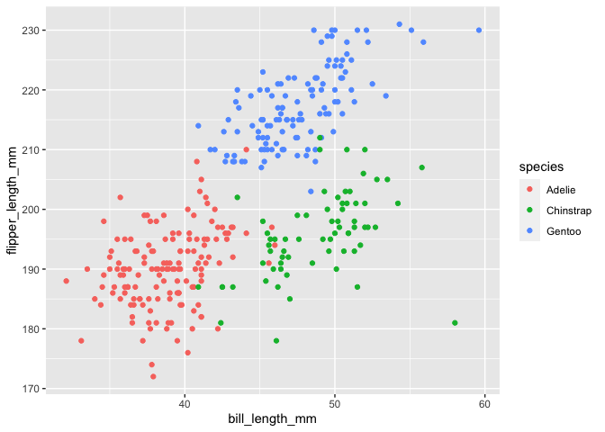

p8105\_hw1\_yw3608
================
Yuxuan Wang
9/29/2021

I’m yw3608’s homework1!

# Problem 1

**First, load the tidyverse library.**

``` r
library(tidyverse)
```

**Next, create a dataframe which satisfy the required question**

``` r
df = 
  tibble(
    score=rnorm(10,mean=0,sd=1),
gr_than_zero =score > 0,
vec_char =c("Lily","Cody","Tommy","Sally","Jack","Anna","Lucy","Coco","Jerry","Stella"),
vec_factor =factor(c("high school diploma","college diploma","college diploma","college diploma","college diploma","college diploma","high school diploma","postgraduate diploma","postgraduate diploma","high school diploma"))
)
df
```

    ## # A tibble: 10 × 4
    ##     score gr_than_zero vec_char vec_factor          
    ##     <dbl> <lgl>        <chr>    <fct>               
    ##  1 -0.519 FALSE        Lily     high school diploma 
    ##  2 -0.637 FALSE        Cody     college diploma     
    ##  3 -0.150 FALSE        Tommy    college diploma     
    ##  4  0.946 TRUE         Sally    college diploma     
    ##  5  0.659 TRUE         Jack     college diploma     
    ##  6 -0.905 FALSE        Anna     college diploma     
    ##  7  0.186 TRUE         Lucy     high school diploma 
    ##  8 -1.38  FALSE        Coco     postgraduate diploma
    ##  9 -1.89  FALSE        Jerry    postgraduate diploma
    ## 10  0.151 TRUE         Stella   high school diploma

**Next, try to take the mean of each variable in my dataframe**

``` r
mean(pull(df,score))
## [1] -0.3537417
mean(pull(df,gr_than_zero))
## [1] 0.4
mean(pull(df,vec_char))
## [1] NA
mean(pull(df,vec_factor))
## [1] NA
```

``` r
#Here, we can take the mean of a random sample of size 10 from a standard Normal distribution
#We can also take the mean of logical vector indicating whether elements of the sample are greater than 0
#We cannot take the mean of  character vector of length 10
#We can not take the mean of a factor vector of length 10, with 3 different factor “levels”**
```

**Next, convert variables from logical vector, character and factor to
numeric by using the as.numeric function. Outputs are hide as
instructed.**

``` r
as.numeric(df$gr_than_zero)
as.numeric(df$vec_char)
as.numeric(df$vec_factor)
```

``` r
#By using as.numeric function, the logical vector changed to either 0 or 1, which means that TRUE OR FALSE. 
#The character vector still shows the warning message which can explain the warning message as 
#I tried to take the mean of it.Argument is not numeric or logical will return NA.
#The factor vector returns to 1,2 or 3, which is the 3 diffenent levels.
```

# Problem 2

**First, install the palmerpenguins packages,and write a short
description of the penguins dataset.**

``` r
data("penguins", package = "palmerpenguins")
summary(penguins)
```

    ##       species          island    bill_length_mm  bill_depth_mm  
    ##  Adelie   :152   Biscoe   :168   Min.   :32.10   Min.   :13.10  
    ##  Chinstrap: 68   Dream    :124   1st Qu.:39.23   1st Qu.:15.60  
    ##  Gentoo   :124   Torgersen: 52   Median :44.45   Median :17.30  
    ##                                  Mean   :43.92   Mean   :17.15  
    ##                                  3rd Qu.:48.50   3rd Qu.:18.70  
    ##                                  Max.   :59.60   Max.   :21.50  
    ##                                  NA's   :2       NA's   :2      
    ##  flipper_length_mm  body_mass_g       sex           year     
    ##  Min.   :172.0     Min.   :2700   female:165   Min.   :2007  
    ##  1st Qu.:190.0     1st Qu.:3550   male  :168   1st Qu.:2007  
    ##  Median :197.0     Median :4050   NA's  : 11   Median :2008  
    ##  Mean   :200.9     Mean   :4202                Mean   :2008  
    ##  3rd Qu.:213.0     3rd Qu.:4750                3rd Qu.:2009  
    ##  Max.   :231.0     Max.   :6300                Max.   :2009  
    ##  NA's   :2         NA's   :2

``` r
#The data in this dataset, including names / values of important variables
#There are in total 8 varialbels.They are species, island,bill_length_mm,bill_depth_mm,flipper_length_mm
#body_mass_g, sex and year.
```

**Secondly, get the size of the dataset by using nrow and ncol.**

``` r
nrow(penguins)
## [1] 344
ncol(penguins)
## [1] 8
##There are 344 rows and 8 colums.
```

**Next,get the mean of flipper length.**

``` r
##Here,I use the na.omit function to omit NA and named the NA-free dataset as penguins_new. 
penguins_new = na.omit(penguins)
mean(pull(penguins_new,flipper_length_mm))
## [1] 200.967
```

**Make a scatterplot of flipper\_length\_mm (y) vs bill\_length\_mm (x);
color points using the species variable (adding color = … inside of aes
in your ggplot code )**

``` r
ggplot(penguins_new,aes(bill_length_mm,flipper_length_mm,colour =species))+ 
  geom_point()
```

<!-- -->

``` r
getwd()
```

    ## [1] "/Users/wangyuxuan/Documents/p8105_hw1_yw3608/p8105_hw1_yw3608/p8105_hw1_yw3608"
